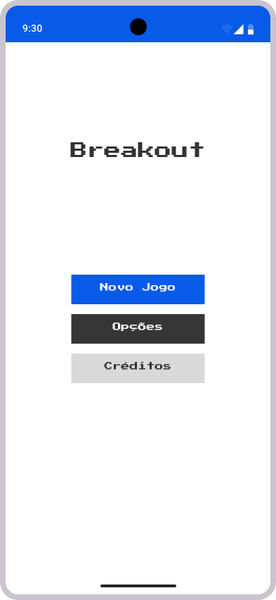
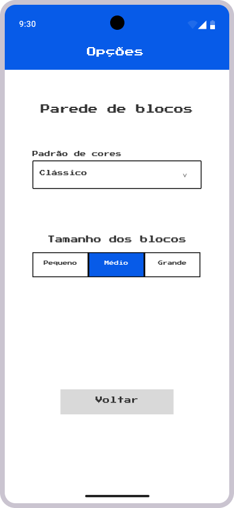
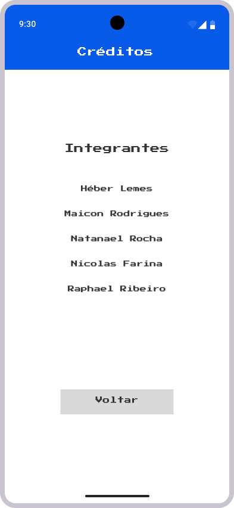

# Wireframes em alta definição das telas

Foram elaborados wireframes em alta definição das telas do aplicativo com Figma. Abaixo estão documentadas algumas decisões e explicações acerca desta prototipagem das telas.

## Tela inicial
A tela inicial apresentará um fundo branco, com o título do aplicativo em destaque no topo ("Breakout") e três botões, sendo o primeiro o que direciona para um novo jogo (nível 1).

O segundo botão direcionará o usuário para a tela de opções, onde ele poderá alterar o padrão de cores e o tamanho dos blocos, ambos relativos à parede de blocos.

Por fim, um botão redireciona para a tela de créditos, contendo os nomes dos integrantes da equipe de desenvolvimento deste projeto.

Utilizamos, predominantemente, cores que remetem à identidade visual da Universidade de Caxias do Sul, sendo elas: branco (#ffffff), azul (#004fe0) e cinza escuro (#404042).

Para os textos, utilizamos a fonte "Press Start 2P", disponível na biblioteca do Google Fonts.

## Tela de configuração da parede de blocos

Esta tela apresentará uma barra (AppBar) no topo, em azul, contendo o nome da página em que o usuário se encontra (no caso, "Opções").

Abaixo, em destaque, haverá o texto que informa ao usuário que se tratam de configurações para a parede de blocos e, logo a seguir, os componentes que permitem a interação do usuário.

Primeiro, haverá um componente para o usuário selecionar o padrão de cores da parede de blocos, contendo uma lista de opções disponíveis.

Além desse, haverá a opção de selecionar o tamanho dos blocos, dispostos horizontalmente, um botão por opção, com coloração de destaque para o selecionado.

Por fim, há um botão de voltar para a tela inicial.

## Tela com a lista de nomes dos integrantes

Esta tela apresentará uma barra com o nome da tela (neste caso, "Créditos") no topo.

Ao centro, serão apresentados os nomes dos integrantes, listados verticalmente.

Por fim, também haverá o botão de voltar para a tela inicial.

## Telas de jogo
> ...
