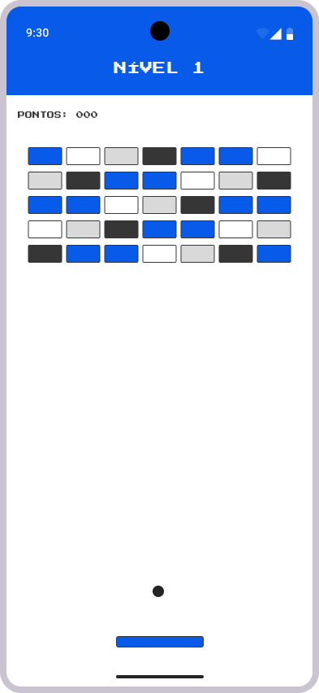
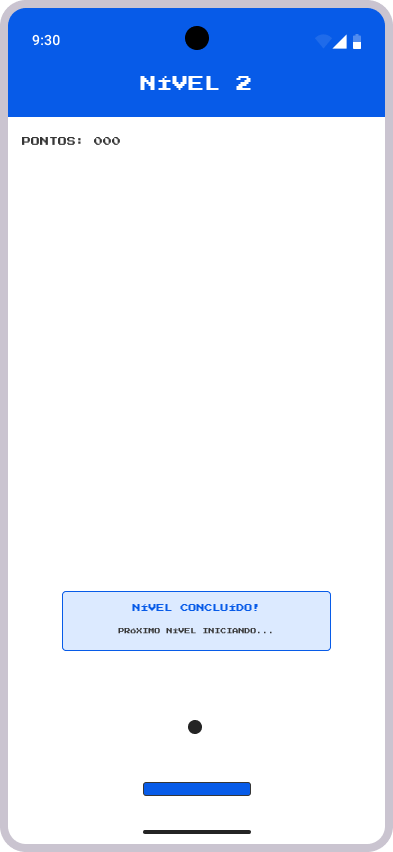
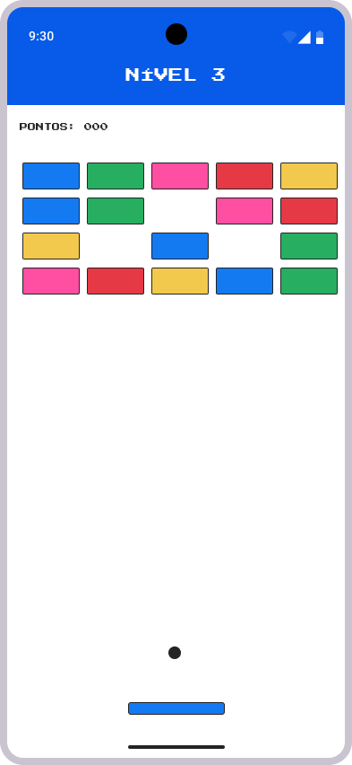
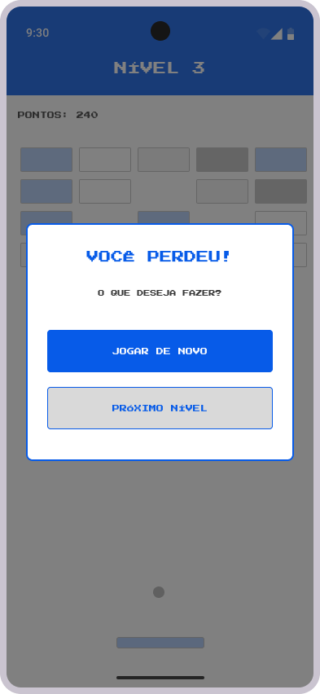
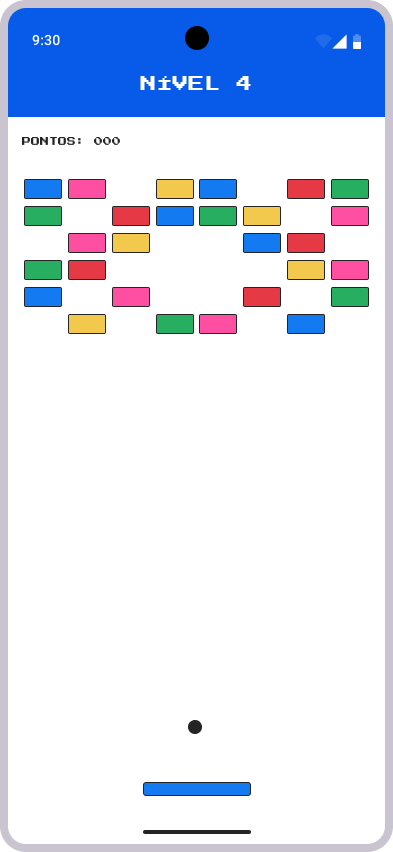
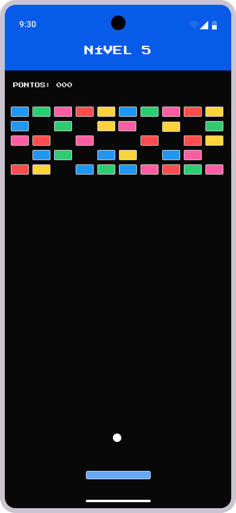

# Wireframes em alta definição das telas

Foram elaborados wireframes em alta definição das telas do aplicativo com a ferramenta Figma.
Eles estão documentados abaixo, junto com algumas explicações acerca da prototipagem.

## Tela inicial
A tela inicial apresentará um fundo branco, com o título do aplicativo em destaque no topo ("Breakout") e três botões, sendo o primeiro o que direciona para um novo jogo (nível 1).

O segundo botão direcionará o usuário para a tela de opções, onde ele poderá alterar o padrão de cores e o tamanho dos blocos, ambos relativos à parede de blocos.

Por fim, um botão redireciona para a tela de créditos, contendo os nomes dos integrantes da equipe de desenvolvimento deste projeto.

Utilizamos, predominantemente, cores que remetem à identidade visual da Universidade de Caxias do Sul, sendo elas: branco (#ffffff), azul (#004fe0) e cinza escuro (#404042).

Para os textos, utilizamos a fonte "Press Start 2P", disponível na biblioteca do Google Fonts.

## Tela de configuração da parede de blocos

Esta tela apresentará uma barra (AppBar) no topo, em azul, contendo o nome da página em que o usuário se encontra (no caso, "Opções").

Abaixo, em destaque, haverá o texto que informa ao usuário que se tratam de configurações para a parede de blocos e, logo a seguir, os componentes que permitem a interação do usuário.

Primeiro, haverá um componente do tipo dropdown (menu suspenso) para o usuário selecionar o padrão de cores da parede de blocos, contendo uma lista de opções disponíveis.

Além desse, haverá a opção de selecionar o tamanho dos blocos, apresentada como um grupo de botões (Pequeno / Médio / Grande) dispostos horizontalmente, com destaque visual (cor azul) para a opção selecionada.

Por fim, há um botão de voltar para a tela inicial.

## Tela com a lista de nomes dos integrantes

Esta tela apresentará uma barra com o nome da tela (neste caso, "Créditos") no topo.

Ao centro, serão apresentados os nomes dos integrantes, listados verticalmente.

Por fim, também haverá o botão de voltar para a tela inicial.

---

## Telas de jogo

Para o jogo em si, desenvolvemos alguns _wireframes_ que representam os diferentes níveis (e algumas situações) de jogo. 

Quanto ao primeiro nível, a parede de blocos sempre será completa.

Já para os outros níveis, como citado na documentação dos métodos de construção da parede de blocos, utilizaremos de aleatoriedade, o que faz com que dificilmente um _wireframe_ represente o nível específico em questão. Decidimos então, que no lugar de apenas apresentar um por nível para as diferenças da parede de blocos, demontraremos diferentes tamanhos de blocos e padrões de cores, além de situações como quando o usuário "perder" ou avançar de nível.

### Nível 1, com padrão de cores Clássico Claro e tamanho dos blocos médio
Como citado anteroirmente, o nível 1 apresentará a parede de blocos completa. Neste wireframe utilizamos o padrão de cores clássico para representar os níveis, podendo, na hora da implementação, adicionar mais padrões de cores.

### Nível 2 ao avançar de nível

### Nível 3, com padrão de cores Colorido Claro e tamanho dos blocos grande

### Nível 3, ao perder o nível

### Nível 4

### Nível 5, no padrão Colorido Escuro e tamanho dos blocos pequeno

